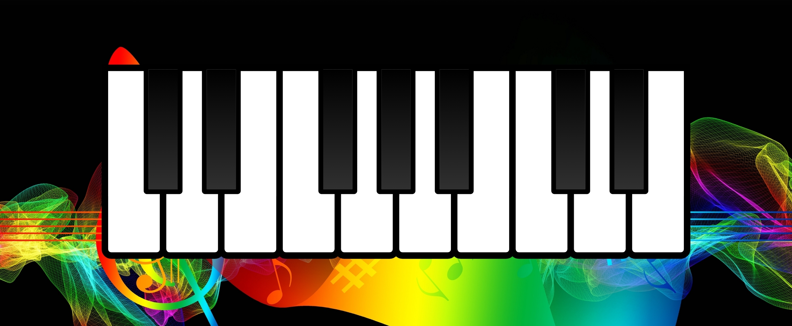

# Piano

### One of my first projects

#### It was fun building it at the time.

#### I will update it in the near future for sure. --- Updated it! ---

#### You can click on the piano or play on the keyboard key "Q" to "P" for the white and "2-3", "5-6-7", "9-0" for the black ones!

Used:
- JS
- CSS
- HTML

